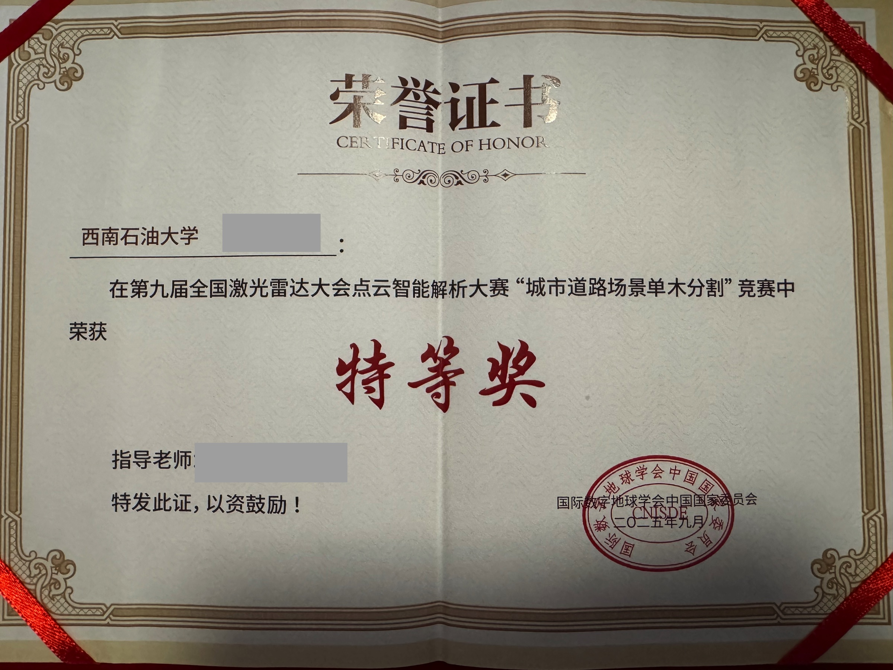
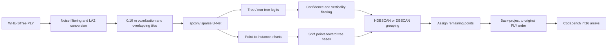

# SparseTree3D

[](https://github.com/thx082700/SparseTree3D/actions/workflows/ci.yml)
[](https://www.python.org/)
[](LICENSE)
[](http://www.lidar2025wuhan.com/resources1.html)

Competition code and reproducibility package for **urban street-tree instance
segmentation from mobile-LiDAR point clouds**. The system adapts TreeLearn's
`spconv` sparse U-Net to WHU-STree, predicts tree semantics and point-to-instance
offsets, clusters shifted points, and maps the instance labels back to every point
required by Codabench.

**Competition outcome:** Grand Prize (official award: 特等奖), Track 3 “Urban
Street-Tree Instance Segmentation,” 9th National LiDAR Conference Point Cloud
Intelligent Processing Competition, 2025. Submission `362701` achieved **0.829
F1** and **0.903 weighted coverage**, finishing **2nd on the final public
leaderboard**. An earlier September 2 snapshot placed the same submission first
before later entries were posted.

[中文说明](README_CN.md) · [Reproduction guide](docs/reproduction.md) ·
[Results and evidence](docs/results.md) · [Code provenance](docs/provenance.md)


## Verified result

| Evidence | Value |
| --- | --- |
| Competition track | Track 3, Urban Street-Tree Instance Segmentation |
| Codabench participant | `thx0827` |
| Submission ID | `362701` |
| Coverage (Cov) | 0.849 |
| Weighted coverage (WCov) | 0.903 |
| Precision | 0.843 |
| Recall | 0.816 |
| **F1** | **0.829** |
| Final public leaderboard | **2nd** |
| Official award | **Grand Prize (特等奖)** |

The final rank and the award are different records: the leaderboard orders
Codabench submissions, while the certificate records the prize issued by the
competition organizer. The [September 2 leaderboard snapshot](assets/leaderboard.png),
[final leaderboard screenshot](assets/leaderboard_final.png), and
[privacy-redacted certificate photograph](assets/award_certificate_redacted.jpg)
are preserved separately so the claims remain auditable. The public certificate
image uses opaque blocks over the recipient and supervisor names; the competition
title, award level, organizer seal, and date remain visible.



## Prediction gallery

The following images are the original figures embedded in the post-competition
presentation. Colors identify predicted tree instances; gray points are the
surrounding road scene.

| Scene | Challenge |
| --- | --- |
|  | Variable tree size and multiple rows |
|  | Uneven point density |
|  | Overlapping broadleaf crowns |
|  | Mixed broadleaf and conifer geometry |

## What this release contains

Version 0.2 replaces the earlier reconstruction-only model with the recovered
competition implementation:

- `spconv` sparse U-Net and semantic/offset heads used by the TreeLearn pipeline;
- WHU-STree PLY-to-LAZ conversion for labeled training data and unlabeled test data;
- random-crop generation, tiled validation, mixed-precision training, and checkpointing;
- eight scene-specific inference configurations recovered from the competition project;
- HDBSCAN/DBSCAN grouping of offset-shifted points and nearest-neighbour assignment;
- exact-order label back-projection to Codabench `int16` column vectors;
- standalone submission validation, instance metrics, tests, and a CPU smoke demo;
- original result figures, leaderboard records, award evidence, and CV wording.

The recovered project archive did **not** contain the WHU-STree training point
clouds or the fine-tuned `epoch_1000.pth` that produced submission `362701`.
The supplied 353 MB `hais_ckpt_spconv2.pth` is the SoftGroup/HAIS initialization
referenced by the training config, not the final competition checkpoint. It is
therefore not presented here as a score-reproducing model. See
[Reproducibility boundary](#reproducibility-boundary).

## Method



The network has a seven-level sparse encoder-decoder with residual blocks. Its
two heads predict:

1. a two-class tree/non-tree score for every retained point; and
2. a three-dimensional offset toward the corresponding tree base/instance center.

The recovered training code combines pointwise cross entropy with an offset
endpoint loss and scales the semantic term by 50. At inference time, the pipeline
filters points by semantic confidence, verticality, and offset magnitude before
grouping the shifted coordinates. Remaining tree points are assigned to the
nearest valid instance. The scene configurations retain the exact competition
hyperparameters, including a 0.10 m voxel size, `tau_vert=0.6`, `tau_off=4`, and
`tau_min=50`.

## Repository map

```text
SparseTree3D/
├── src/tree_learn/              # recovered GPU model, dataset, and pipeline code
├── src/sparsetree3d/            # portable adapters, metrics, I/O, and validation
├── configs/competition/
│   ├── _modular/                # model, grouping, sampling, and dataset defaults
│   ├── pipeline/                # eight scene-specific inference configs
│   └── train.yaml               # recovered training schedule
├── tools/competition/           # original-style train/infer/evaluation entry points
├── tools/convert_whu_stree.py   # PLY to TreeLearn LAZ conversion
├── tools/run_competition_batch.py
├── tools/export_submission.py   # label back-projection and ZIP export
├── examples/synthetic_demo.py   # CPU-only clustering smoke test
├── tests/                       # portable regression tests
├── assets/                      # original report figures and evidence
└── docs/                        # method, results, provenance, and reproduction notes
```

## Quick verification on CPU

This command verifies installation, clustering, metrics, and submission utilities.
It does not claim to reproduce the neural prediction shown above.

```bash
git clone https://github.com/thx082700/SparseTree3D.git
cd SparseTree3D
python -m venv .venv
source .venv/bin/activate
python -m pip install -U pip
python -m pip install -e ".[dev]"
python examples/synthetic_demo.py
pytest
```

## GPU environment

The recovered setup used Python 3.10, PyTorch 2.0.0, CUDA 11.8, and
`spconv-cu118`. A CUDA-capable Linux workstation is recommended.

```bash
conda env create -f environment.yml
conda activate sparsetree3d
```

If your CUDA runtime differs, install the matching PyTorch and `spconv` builds
manually, then install the repository:

```bash
python -m pip install -e ".[competition,dev]"
```

## Dataset layout

Download or request WHU-STree from its
[official repository](https://github.com/WHU-USI3DV/WHU-STree). Do not commit the
dataset to this repository.

```text
data/raw/WHU-STree-for-competition/
├── train/
│   ├── 05/PCD/*.ply
│   └── ...
└── test/
    ├── 05/PCD/*.ply
    └── ...
```

Convert the PLY data into the layout expected by the recovered pipeline:

```bash
python tools/convert_whu_stree.py \
  data/raw/WHU-STree-for-competition/train \
  data/competition/train --labeled

python tools/convert_whu_stree.py \
  data/raw/WHU-STree-for-competition/test \
  data/competition/test
```

The converter filters non-finite coordinates and the extreme coordinate outliers
documented in the competition scripts. Use `--keep-large-coordinates` only after
inspecting those scenes.

## Training

Place the external SoftGroup/HAIS initialization at
`checkpoints/hais_ckpt_spconv2.pth`, then generate crops and validation tiles:

```bash
python tools/competition/data_gen/gen_train_data.py \
  --config configs/competition/gen_train_data.yaml

python tools/competition/data_gen/gen_val_data.py \
  --config configs/competition/gen_val_data.yaml

python tools/train.py --config configs/competition/train.yaml \
  --work_dir competition
```

The recovered schedule uses AdamW, learning rate `0.003`, batch size `6`, 500
samples per epoch, mixed precision, and up to 3,000 epochs. Checkpoints are written
under `work_dirs/competition/` every 20 epochs.

## Inference and submission

Copy the selected fine-tuned checkpoint to
`checkpoints/competition_epoch_1000.pth`, then run one scene:

```bash
python tools/infer.py \
  --config configs/competition/pipeline/pipeline_13_2.yaml
```

Run all eight recovered competition configurations:

```bash
python tools/run_competition_batch.py
```

Back-project the LAZ predictions to the original PLY order and build the flat ZIP:

```bash
python tools/export_submission.py \
  data/raw/WHU-STree-for-competition/test \
  data/competition/test \
  outputs/sparsetree3d_submission.zip
```

The exporter writes one `int16` array of shape `[N, 1]` per input cloud. Positive
values denote tree instances and `-1` denotes background/unassigned points, which
matches the recovered submission conversion scripts.

## Evaluation

For already aligned NumPy ground truth and prediction directories:

```bash
sparsetree-evaluate data/reference_npy outputs/predictions \
  --iou-threshold 0.75
```

The portable evaluator reports precision, recall, F1, Cov, and WCov. For the
original TreeLearn forest-level protocol, use:

```bash
python tools/competition/evaluation/evaluate.py \
  --config configs/competition/evaluate.yaml
```

## Reproducibility boundary

| Artifact | Included | Notes |
| --- | :---: | --- |
| Competition-specific source and configs | Yes | Paths sanitized; algorithms preserved |
| Original prediction figures | Yes | Extracted unchanged from the supplied report |
| Leaderboard and award evidence | Yes | Historical and final snapshots kept separately |
| WHU-STree competition data | No | Dataset ownership and distribution restrictions apply |
| SoftGroup/HAIS initialization | No | External 353 MB pretraining artifact |
| Fine-tuned competition checkpoint | No | Not present in the recovered project archive |
| Original training logs | No | Not present in the recovered project archive |

The published scores document submission `362701`; they are not represented as a
fresh rerun of the repository. Reproducing the exact score requires the original
competition split and the fine-tuned checkpoint or a full retraining run.

## Project role and attribution

Competition adaptation and submission by **Haoxi Tian (田浩希), Southwest
Petroleum University**, under the supervision of **Junnan Xiong (熊俊楠)** and
**Hongliang Jia (贾宏亮)**.

The model and several pipeline modules are adapted from
[TreeLearn](https://github.com/ecker-lab/TreeLearn), which builds on SoftGroup and
spconv. The repository does not claim authorship of the upstream method. The
competition contribution is the WHU-STree adaptation, training configuration,
scene preprocessing, batch inference, result refinement/back-projection, and
Codabench submission workflow. See [THIRD_PARTY_NOTICES.md](THIRD_PARTY_NOTICES.md).

## Citation

If this repository supports your work, cite the software through
[`CITATION.cff`](CITATION.cff) and cite both TreeLearn and WHU-STree using the
bibliographic information from their official repositories.

## License

SparseTree3D's original code and documentation are released under the
[MIT License](LICENSE). Upstream-derived TreeLearn files remain subject to the
MIT notice in [`third_party/TreeLearn_LICENSE`](third_party/TreeLearn_LICENSE).
