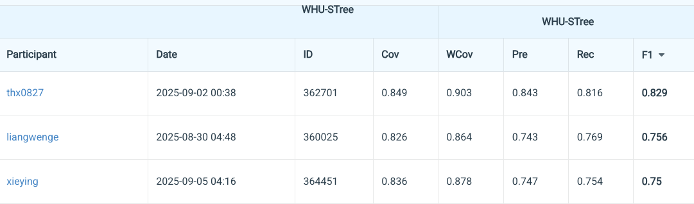

# SparseTree3D

[](https://github.com/thx082700/SparseTree3D/actions/workflows/ci.yml)
[](https://www.python.org/)
[](LICENSE)

SparseTree3D is a sparse-convolution pipeline for instance segmentation of urban street trees
from mobile LiDAR point clouds. It is a clean, documented implementation of the approach used
for Track 3, *Urban Street-Tree Instance Segmentation*, in the 9th National LiDAR Conference
Point Cloud Intelligent Processing Competition (2025).

**Award:** Second Prize in Track 3. The public leaderboard snapshot preserved in the competition
report ranked the submission first at the time of capture, with an F1 score of **0.829**.


## Highlights

- Sparse 3D U-Net built with MinkowskiEngine for large mobile-mapping point clouds.
- Joint tree/background classification and per-point centroid-offset regression.
- Offset-guided DBSCAN clustering with explicit correction for small fragments and oversized
  merged crowns.
- Native support for the WHU-STree PLY layout and Codabench-compatible `int16` outputs.
- Standalone, tested evaluation for Precision, Recall, F1, Coverage, and Weighted Coverage.

## Competition result

| Metric | Score |
| --- | ---: |
| Coverage (Cov) | 0.849 |
| Weighted Coverage (WCov) | 0.903 |
| Precision at IoU 0.75 | 0.843 |
| Recall at IoU 0.75 | 0.816 |
| F1 at IoU 0.75 | **0.829** |



The scores above come from the submitted competition report, dated September 2, 2025. The
competition organizer awarded the project Second Prize. This repository does not redistribute
the retired competition split or its original checkpoint, so the table documents the historical
submission rather than an out-of-the-box reproduction claim.

## Method


The network optimizes

```text
L = L_semantic + lambda_offset * L_offset
```

where `L_semantic` is weighted binary cross entropy and `L_offset` is mean squared error on tree
points. Offset regression collapses points from the same tree toward a shared instance center,
making density clustering more reliable when crowns overlap. See [the method note](docs/method.md)
for the implementation details and metric definitions.

## Installation

The evaluation and post-processing modules run on CPU and do not require PyTorch:

```bash
git clone https://github.com/thx082700/SparseTree3D.git
cd SparseTree3D
python -m venv .venv
source .venv/bin/activate
pip install -U pip
pip install -e ".[dev]"
python examples/synthetic_demo.py
pytest
```

Training requires a CUDA-compatible PyTorch installation and MinkowskiEngine. Install PyTorch
for your CUDA runtime, then build
[MinkowskiEngine](https://github.com/NVIDIA/MinkowskiEngine) against the same toolchain:

```bash
pip install -e ".[train]"
# Install MinkowskiEngine by following its CUDA/PyTorch compatibility instructions.
```

## Dataset setup

Request WHU-STree through its
[official repository](https://github.com/WHU-USI3DV/WHU-STree). The competition-version data is
no longer distributed, but this code supports the current release documented as:

```text
data/WHU-STree-NJ/
├── 00/
│   └── PCD/
│       ├── 1.ply
│       └── 2.ply
├── 01/
│   └── PCD/
│       └── ...
├── reference_data/
└── test_split.txt
```

Each labeled PLY is expected to provide `[x, y, z, intensity, tree, label]`, where `tree` is the
instance ID and `label` is the species ID. Create road-disjoint train and validation manifests:

```bash
python tools/prepare_manifest.py data/WHU-STree-NJ --output-dir data/splits
```

Review the generated split before training. If you use an official split, replace the manifest
files instead of mixing official test roads into training.

## Training

Edit paths and hyperparameters in [`configs/whu_stree.yaml`](configs/whu_stree.yaml), then run:

```bash
python tools/train.py --config configs/whu_stree.yaml
```

To fine-tune an S3DIS-pretrained sparse backbone, set `model.pretrained_backbone` to a compatible
checkpoint. Shape-compatible encoder/decoder layers load automatically; task heads remain newly
initialized when their shapes differ.

## Inference and submission

```bash
python tools/infer.py \
  --config configs/whu_stree.yaml \
  --checkpoint checkpoints/best.pth \
  --output-dir outputs/predictions

sparsetree-submit outputs/predictions outputs/sparsetree3d_submission.zip
```

The submission validator enforces the competition contract: one flat ZIP containing one
non-negative `int16` vector per point cloud, named `<road_id>_<point_cloud_id>.npy`.

## Evaluation

```bash
sparsetree-evaluate data/WHU-STree-NJ/reference_data outputs/predictions \
  --iou-threshold 0.75
```

Predicted and ground-truth instances use one-to-one Hungarian matching. Detection metrics apply
an IoU threshold of 0.75, while Cov and WCov measure each ground-truth tree's best overlap. The
implementation handles background ID `0` and ignores negative labels.

## Repository map

```text
src/sparsetree3d/
├── data.py          # voxelization, centroid targets, and manifests
├── model.py         # sparse encoder-decoder and two prediction heads
├── losses.py        # weighted semantic CE + offset MSE
├── postprocess.py   # clustering, fragment merge, oversized-cluster split
├── metrics.py       # Track 3 instance and coverage metrics
├── io.py            # PLY reader and validated Codabench output
└── engine.py        # training and inference loops
```

## Reproducibility scope

This public release reconstructs the method described in the competition report and packages the
engineering pieces needed to train, infer, evaluate, and submit. The original competition data,
checkpoint, and training logs were not included in the supplied materials. Hyperparameters in the
default configuration are therefore documented starting points and should be tuned on a held-out
road-level validation split.

## Citation and acknowledgements

WHU-STree is maintained by the WHU-USI3DV team. If you use the dataset, cite the official paper:

```bibtex
@article{ding2026whu,
  title   = {WHU-STree: A multi-modal benchmark dataset for street tree inventory},
  author  = {Ding, Ruifei and Chen, Zhe and Fan, Wen and Long, Chen and
             Xiao, Huijuan and Zeng, Yelu and Dong, Zhen and Yang, Bisheng},
  journal = {ISPRS Journal of Photogrammetry and Remote Sensing},
  volume  = {233},
  pages   = {519--542},
  year    = {2026},
  doi     = {10.1016/j.isprsjprs.2026.02.011}
}
```

The result images and leaderboard snapshot are reproduced from the author's competition report.
No WHU-STree point clouds, annotations, or panoramic images are redistributed by this repository.
