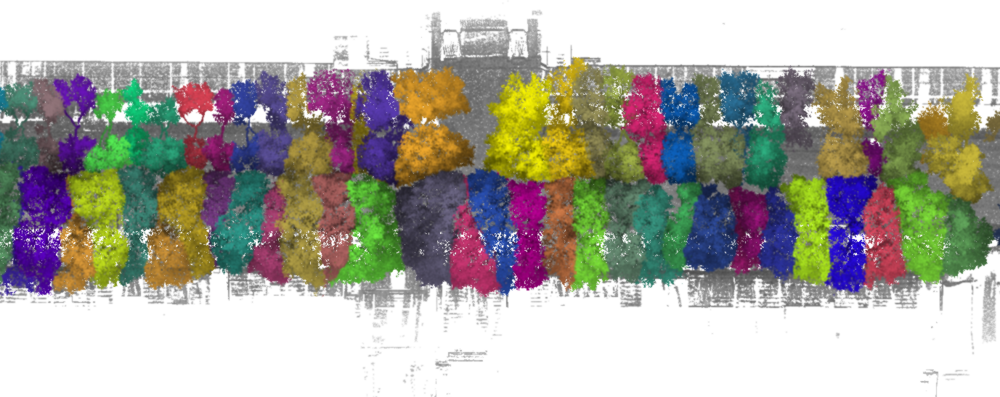

# SparseTree3D

SparseTree3D 是面向车载激光雷达城市行道树点云的单木实例分割项目。项目实现了第九届
全国激光雷达大会点云数据智能解析比赛赛道三方案：稀疏三维卷积编码器/解码器同时预测
树木语义和指向实例中心的偏移向量，再通过聚类与尺寸感知后处理生成单木实例。

**比赛成绩：赛道三二等奖。** 汇报材料中保存的 2025 年 9 月 2 日公开榜单截图显示，
当时提交以 F1 0.829 位列榜首。

| 指标 | 成绩 |
| --- | ---: |
| Cov | 0.849 |
| WCov | 0.903 |
| Precision（IoU 0.75） | 0.843 |
| Recall（IoU 0.75） | 0.816 |
| F1（IoU 0.75） | **0.829** |



## 主要内容

- 基于 MinkowskiEngine 的稀疏三维 U-Net。
- 树木/背景加权交叉熵与单木中心偏移均方误差联合训练。
- 在偏移后的点上执行 DBSCAN，并针对小碎片过分割和大簇欠分割进行后处理。
- 读取 WHU-STree 官方 PLY 结构，输出 Codabench 要求的 `int16` 实例标签。
- 独立实现 Precision、Recall、F1、Cov、WCov，并配有单元测试。

## 快速开始

仅运行后处理、评测和合成示例不需要 CUDA：

```bash
python -m venv .venv
source .venv/bin/activate
pip install -U pip
pip install -e ".[dev]"
python examples/synthetic_demo.py
pytest
```

训练前需安装与本机 CUDA 匹配的 PyTorch，并按
[MinkowskiEngine 官方说明](https://github.com/NVIDIA/MinkowskiEngine)完成编译：

```bash
pip install -e ".[train]"
```

通过 [WHU-STree 官方仓库](https://github.com/WHU-USI3DV/WHU-STree)申请数据。当前发布版
每个 PLY 的字段为 `[x, y, z, intensity, tree, label]`，其中 `tree` 是实例标签。

```bash
python tools/prepare_manifest.py data/WHU-STree-NJ --output-dir data/splits
python tools/train.py --config configs/whu_stree.yaml
python tools/infer.py --config configs/whu_stree.yaml \
  --checkpoint checkpoints/best.pth --output-dir outputs/predictions
sparsetree-submit outputs/predictions outputs/submission.zip
```

赛时版本数据已停止发放，本仓库也不包含比赛数据、原始权重或标注。当前代码依据汇报方案
整理，默认参数是面向当前公开版数据的起点；正式实验应在按道路划分的验证集上重新调参。

更完整的安装、训练、评测和引用说明见 [English README](README.md)。

