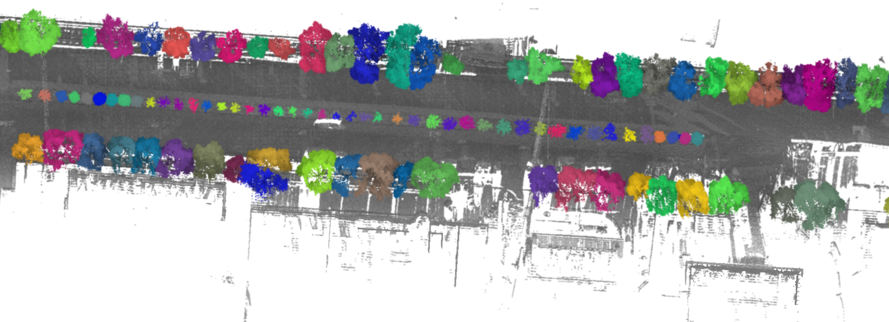
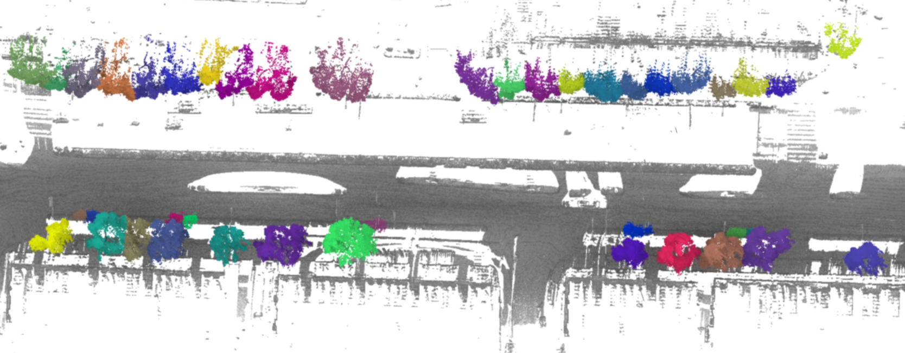
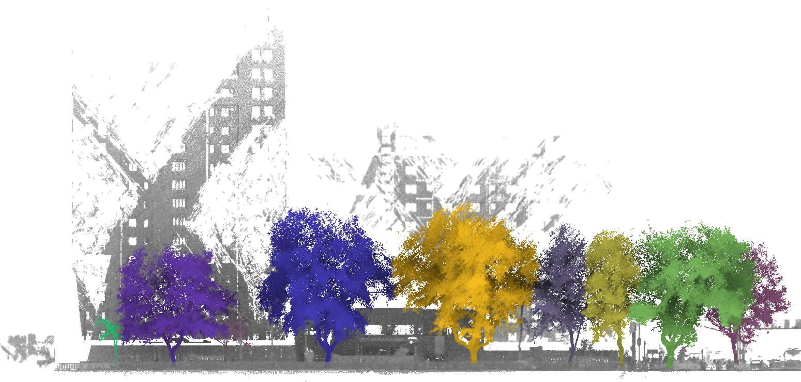
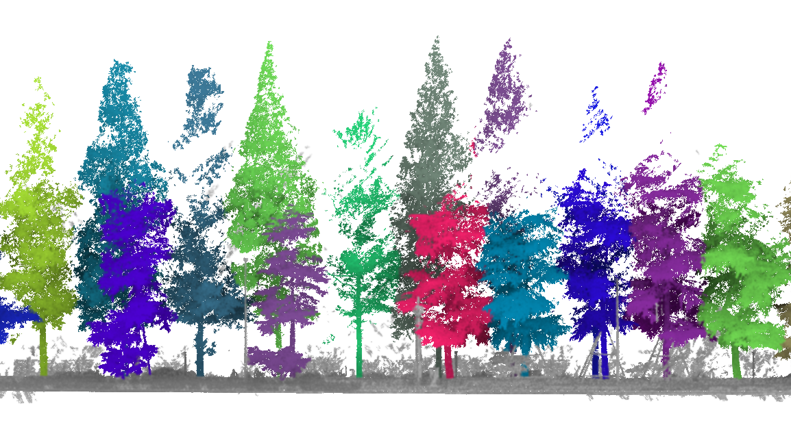

# Street-Tree-Segmentation-Mobile-Laser-Scanning

[](https://github.com/thx082700/Street-Tree-Segmentation-Mobile-Laser-Scanning/actions/workflows/ci.yml)
[](https://www.python.org/)
[](LICENSE)
[](http://www.lidar2025wuhan.com/resources1.html)

2025 年第九届全国激光雷达大会点云智能解析大赛赛道三
“城市道路场景单木分割”的第一名方案。

[English](README.md)


## 预测结果展示

以下图片来自比赛结束后的汇报材料。不同颜色表示预测的单木实例，
灰色点表示周围道路场景。

| 场景 | 难点 |
| --- | --- |
|  | 树木大小不同，多排行道树 |
|  | 点云密度不均匀 |
|  | 阔叶树冠相互重叠 |
|  | 阔叶树与针叶树混合 |

## 安装

使用支持 CUDA 的 Linux 工作站，环境为 Python 3.10、PyTorch 2.0.0、
CUDA 11.8 和 `spconv-cu118`。

```bash
git clone https://github.com/thx082700/Street-Tree-Segmentation-Mobile-Laser-Scanning.git
cd Street-Tree-Segmentation-Mobile-Laser-Scanning
conda create -n Street-Tree-Segmentation-Mobile-Laser-Scanning python=3.10
conda activate Street-Tree-Segmentation-Mobile-Laser-Scanning
conda install pytorch=2.0.0 torchvision=0.15.0 torchaudio=2.0.0 \
  pytorch-cuda=11.8 -c pytorch -c nvidia
python -m pip install spconv-cu118
python -m pip install -e ".[competition]"
```

## 数据准备

从 [WHU-STree 官方仓库](https://github.com/WHU-USI3DV/WHU-STree)获取数据集。
将带标签的训练 PLY 文件放在
`data/raw/WHU-STree-for-competition/train/<road>/PCD/`，
测试 PLY 文件放在 `data/raw/WHU-STree-for-competition/test/<road>/PCD/`。

转换训练和测试点云：

```bash
python tools/convert_whu_stree.py \
  data/raw/WHU-STree-for-competition/train \
  data/competition/train --labeled
python tools/convert_whu_stree.py \
  data/raw/WHU-STree-for-competition/test \
  data/competition/test
```

从 `data/competition/train/forests/` 中移出一份点云作为验证集，
放入 `data/competition/val/forest/`。默认配置使用 `12_1.laz`；
如果使用其他文件，请修改 `configs/competition/gen_val_data.yaml` 中的 `forest_path`。
然后生成训练裁块和验证瓦片：

```bash
python tools/competition/data_gen/gen_train_data.py \
  --config configs/competition/gen_train_data.yaml
python tools/competition/data_gen/gen_val_data.py \
  --config configs/competition/gen_val_data.yaml
```

## 训练

将 SoftGroup/HAIS 预训练初始化权重放到 `checkpoints/hais_ckpt_spconv2.pth`，
然后开始训练：

```bash
python tools/train.py --config configs/competition/train.yaml \
  --work_dir competition
```

训练设置位于 `configs/competition/train.yaml`，模型权重保存在
`work_dirs/competition/` 下。

## 推理

将微调后的模型权重放到 `checkpoints/competition_epoch_1000.pth`，
然后对一个场景进行推理：

```bash
python tools/infer.py \
  --config configs/competition/pipeline/pipeline_13_2.yaml
```

运行全部八个场景配置：

```bash
python tools/run_competition_batch.py
```

## 评估

对点序已对齐的 NumPy 真值和预测目录进行评估：

```bash
sparsetree-evaluate data/reference_npy outputs/predictions \
  --iou-threshold 0.75
```

评估输出精确率（Precision）、召回率（Recall）、F1、Cov 和 WCov。
进行森林级评估时，先在 `configs/competition/evaluate.yaml` 中设置
`paths.pred_forest_path` 和 `paths.gt_forest_path`，然后运行：

```bash
python tools/competition/evaluation/evaluate.py \
  --config configs/competition/evaluate.yaml
```

## 引用

如果本仓库支持了你的研究，请通过 [`CITATION.cff`](CITATION.cff)引用本软件，
并根据 WHU-STree 官方仓库提供的文献信息引用数据集。

## 许可证

本项目的原创代码和文档采用 [MIT 许可证](LICENSE)。
派生自 TreeLearn 的文件继续遵循
[`third_party/TreeLearn_LICENSE`](third_party/TreeLearn_LICENSE)中的 MIT 许可声明。

请同时根据 TreeLearn [官方仓库](https://github.com/ecker-lab/TreeLearn)
提供的文献信息引用该项目。
