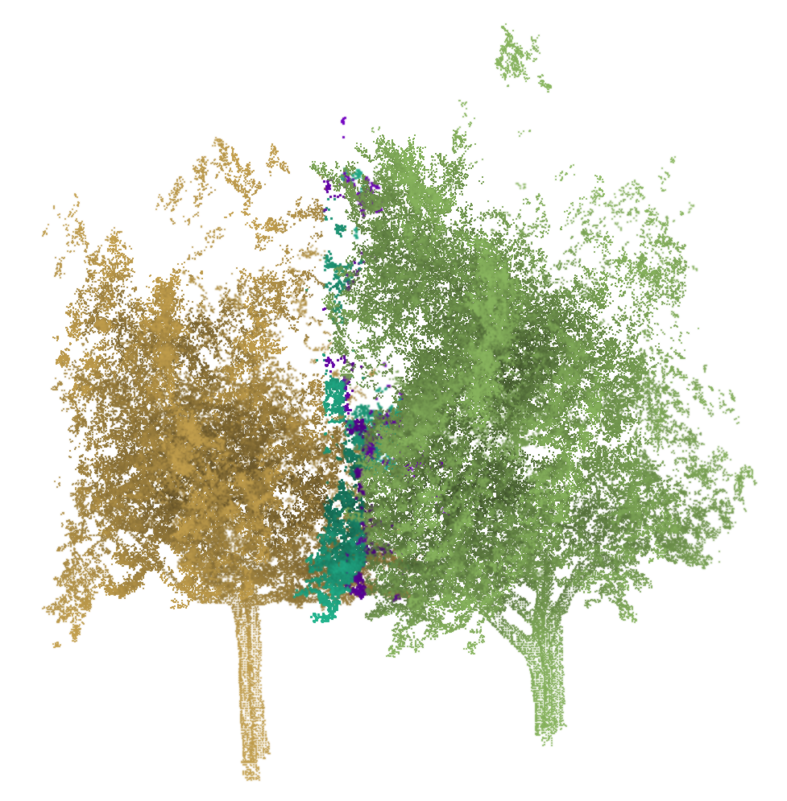
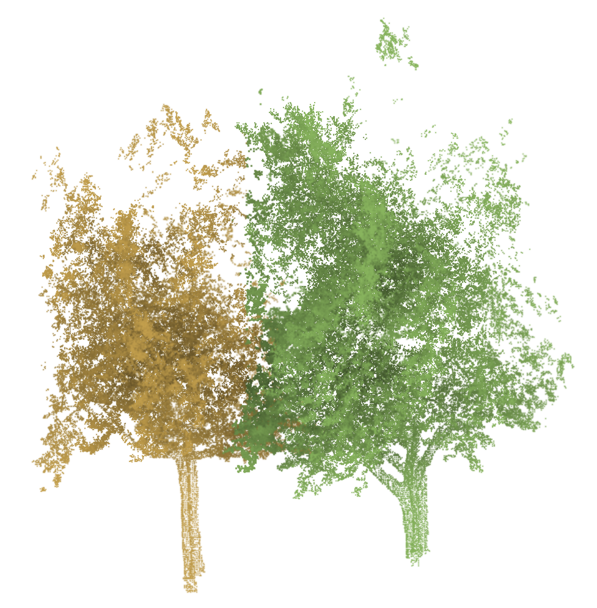

# Method

## Task

For every point in a mobile-LiDAR street scene, predict `-1` for background or a
positive integer identifying one tree. The system must separate adjacent crowns
while preserving each tree's trunk and crown coverage.

## Sparse backbone

The recovered model uses `spconv` rather than MinkowskiEngine. Input coordinates
are quantized at 0.10 m and converted to sparse voxels. A seven-level U-Net uses
residual sparse-convolution blocks with 32 initial channels. Overlapping tiles
provide context for large scenes without constructing a dense 3D grid.

## Prediction heads and loss

The shared backbone feeds two multilayer perceptrons:

- a two-class semantic head for tree and non-tree logits;
- a three-value offset head pointing each tree point toward its instance base.

The dataset code derives the offset target from a robust mean of low points in
each labeled tree. The training implementation applies pointwise cross entropy
and the mean Euclidean offset error. It multiplies semantic loss by 50 before
summing both terms.

## Grouping

Inference retains points with tree probability at least 0.5. Clustering focuses
on points that also satisfy a verticality threshold of 0.6 and a vertical offset
limit of 4 m. HDBSCAN uses `tau_min=50`; DBSCAN remains available with
`tau_group=0.15` m.

After initial clustering, the pipeline assigns unclustered predicted tree points
to the nearest valid instance in offset-shifted space. Overlapping tiles are
ensembled, and labels are propagated from voxelized points to the original
point-cloud coordinates.

## Competition adapters

The recovered project used multiple label-matching scripts. The public release
consolidates them into a KD-tree implementation with a 1 cm tolerance. This is
both faster and safer than assuming that filtered LAZ points remain in exactly
the same sequence as the PLY input.

## Observed failure modes

Low-density returns can create small fragments, while overlapping crowns can
merge neighboring trees. The post-competition report visualized both cases and
used scene-specific inspection/refinement during submission preparation.

| Before refinement | After refinement |
| --- | --- |
|  |  |
